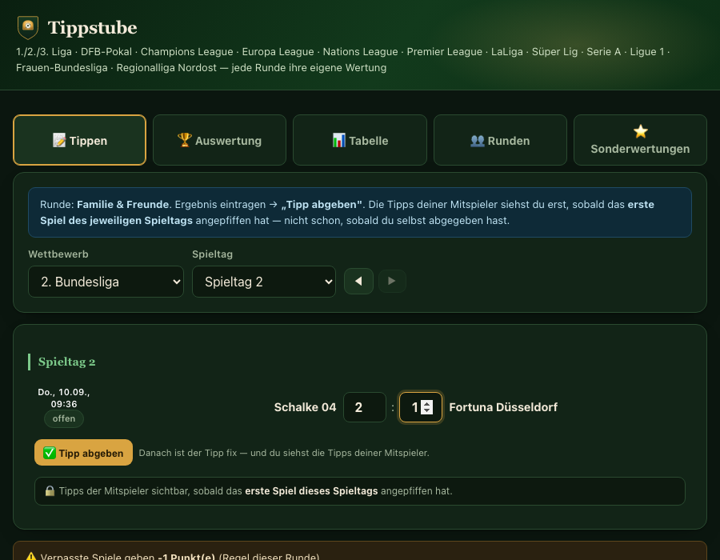
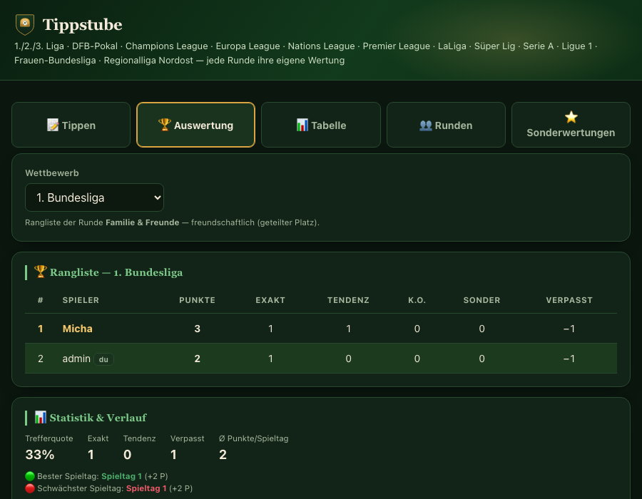
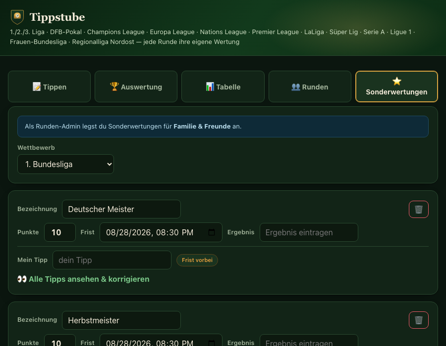
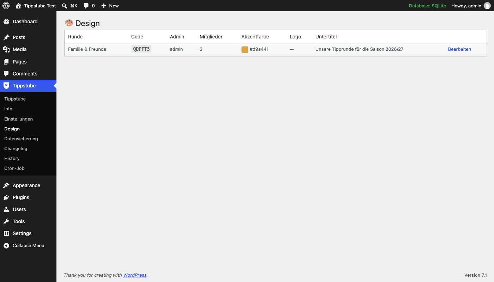
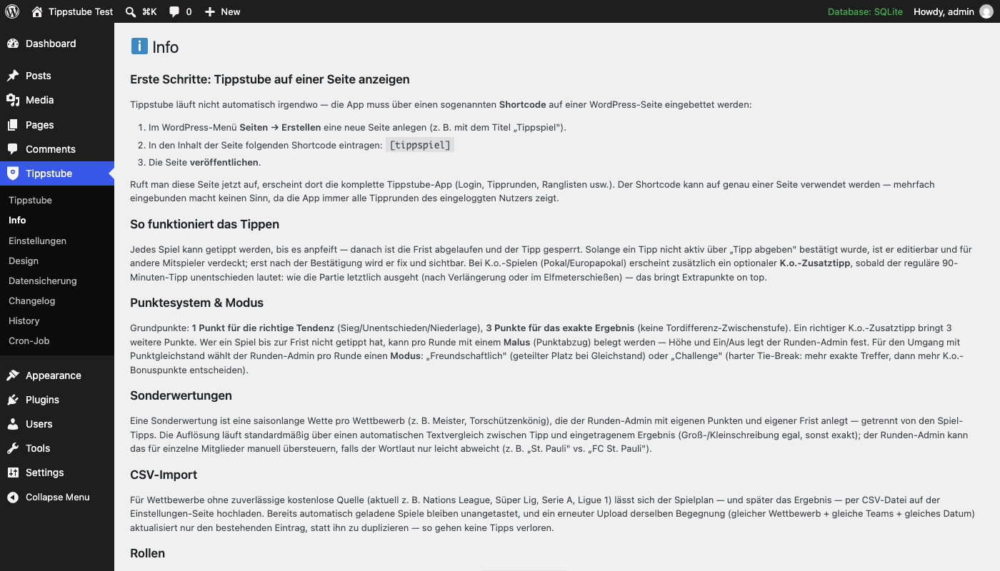

# Tippstube

**Das private Fußball-Tippspiel für deine Familie oder Freundesrunde.** Echtes WordPress-Login, eigene
Tipprunden, automatischer Datenabruf für 14 Wettbewerbe — kostenlos und quelloffen.

## Worum geht's?

Wer mit Familie, Freunden oder Kollegen auf Fußballspiele tippt, kennt das Problem: Ergebnisse gehen in der
WhatsApp-Gruppe unter, die Punkte rechnet irgendwann eine Person mühsam von Hand nach, und am Ende ist
nicht mal klar, wer eigentlich vorne liegt.

Tippstube macht daraus eine echte kleine Webseite: Jeder meldet sich mit einem echten WordPress-Konto an,
tritt einer privaten Tipprunde per Einladungscode bei und tippt dort mit den anderen — jede Runde hat für
jeden Wettbewerb ihre eigene Rangliste, die sich automatisch aktualisiert.

## Funktionen

**Für Mitspieler:**
- 14 Wettbewerbe: 1./2./3. Bundesliga, DFB-Pokal, Champions League, Europa League, Nations League,
  Premier League, LaLiga, Süper Lig, Serie A, Ligue 1, Frauen-Bundesliga, Regionalliga Nordost
- Punktesystem: 1 Punkt für die richtige Tendenz, 3 Punkte fürs exakte Ergebnis, optionaler
  K.o.-Zusatztipp bei Pokalspielen
- Zwei Ranglisten-Modi: Freundschaftlich (geteilter Platz bei Gleichstand) oder Challenge (harter
  Tie-Break)
- Sonderwertungen je Wettbewerb (Meister, Torschützenkönig etc.)
- Pinnwand-Chat und Statistik/Achievements pro Runde
- E-Mail-Benachrichtigungen: Fristen-Erinnerung, wöchentlicher Ranking-Newsletter

| Rangliste | Sonderwertungen |
|---|---|
|  |  |

**Für den Plattform-Admin:**

Sieben Verwaltungsseiten unter "Tippstube" im WordPress-Adminmenü — Einstellungen, Design (Akzentfarbe/
Logo/Untertitel je Tipprunde), Cron-Job (automatischer Abruf, optional per cron-job.org abgesichert),
History (Änderungsprotokoll), Changelog, Info und Datensicherung (Export/Import aller Daten, mit
automatischer Sicherheitskopie vor jedem Restore).

| Design-Übersicht | Admin-Menü |
|---|---|
|  |  |

Updates erscheinen wie bei einem regulären WordPress.org-Plugin direkt im Plugins-Bereich
("Update verfügbar").

## Installation

1. Plugin aus dem [neuesten Release](../../releases/latest) herunterladen und in WordPress hochladen
   (Plugins → Installieren → Plugin hochladen) und aktivieren.
2. Eine neue WordPress-Seite anlegen und den Shortcode `[tippspiel]` in den Inhalt eintragen, dann
   veröffentlichen.
3. Unter Tippstube → Einstellungen ggf. einen kostenlosen [API-Football](https://www.api-football.com/)-Key
   hinterlegen und die Spieldaten abrufen.
4. Fertig — Nutzer können sich anmelden, eine Tipprunde erstellen oder per Einladungscode beitreten.

Für Wettbewerbe ohne gute kostenlose Datenquelle (aktuell: Nations League, Süper Lig, Serie A, Ligue 1)
liegen unter [`sample-data/`](sample-data/) Beispiel-CSV-Dateien zum Import bereit.

Ausführliche Erklärungen zu allen Funktionen: Tippstube → Info im WordPress-Adminmenü, oder in der
mitgelieferten [`README.txt`](fussball-tippspiel/README.txt).

## Lizenz

GPL-2.0-or-later — siehe [LICENSE](LICENSE). Tippstube ist freie Software: du darfst es kostenlos
nutzen, verändern und weitergeben.
